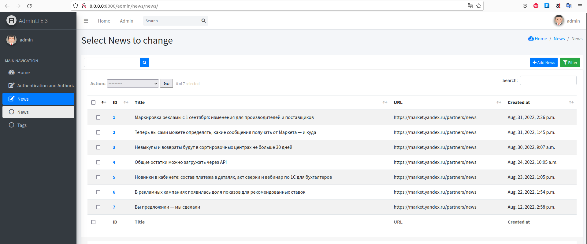
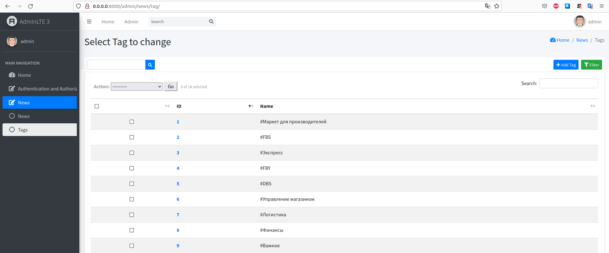
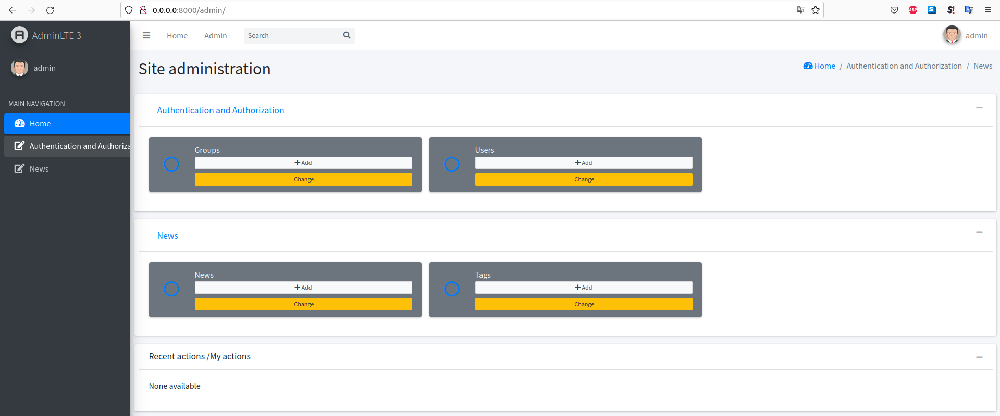

# TestParser
## Запуск проекта в Docker контейнере
* Установите Docker
* Параметры запуска описаны в файлах `docker-compose.yml`
* Запустите docker compose:
```bash
docker-compose up
```
  > После сборки появятся 2 контейнера:
  > 1. контейнер базы данных **db**
  > 2. контейнер приложения **backend**

* Дополнительные команды очистки докера:
```bash
docker stop $(docker ps -aq) && docker rm $(docker ps -aq)
docker rmi $(docker images -a -q)
docker volume prune
```
## Примеры запросов
* Админку можно посмотреть ро адресу `http://0.0.0.0:8000/admin`. Нужно создать учетку админа, написав команду 
```
docker exec -it <container_id> python manage.py createsuperuser
```
* Подробная информация для получения токена авторизации находится по адресу `https://djoser.readthedocs.io/en/latest/index.html`
Для получения токена отправьте креденшл по эндпоинту `http://127.0.0.1:8000/auth/jwt/create/` 
```bash
{
    "username": "admin",
    "password": "admin"
}
```
Полученный токен необходимо добавить в Headers Authorization каждого запроса.
* Отправьте на эндпоинт `http://127.0.0.1:8000/api/news` следующий POST запрос с телом:
```bash
{
    "url": "https://market.yandex.ru/partners/news"
}
```
В результате парсер соберет 10 новостей и загрузит из в БД. 
* Получить 10 новостей можно так: отправьте на эндпоинт `http://127.0.0.1:8000/api/news` GET запрос
* Также работает фильтрация по Tags и Created_at c параметрами:
```bash
http://127.0.0.1:8000/api/news?tags={value}
http://127.0.0.1:8000/api/news?created_at={value}
```
Готово!
### Пример админзоны:
* 
* 
* 